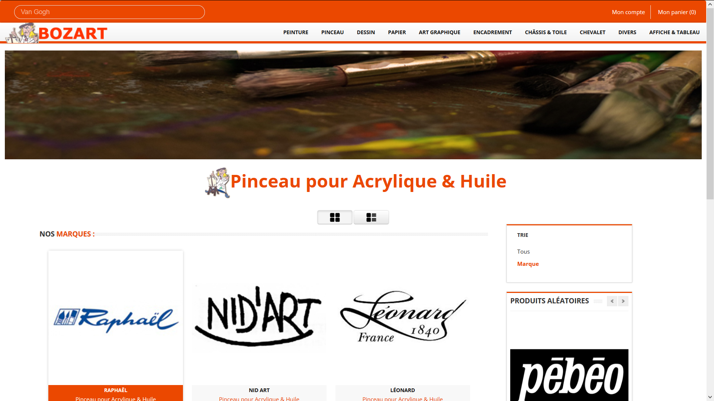
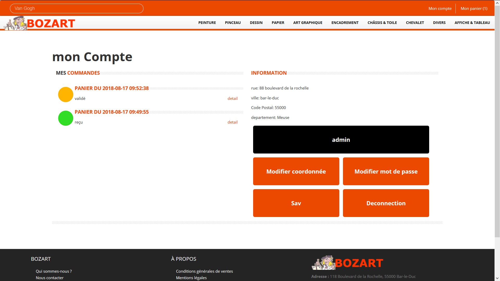
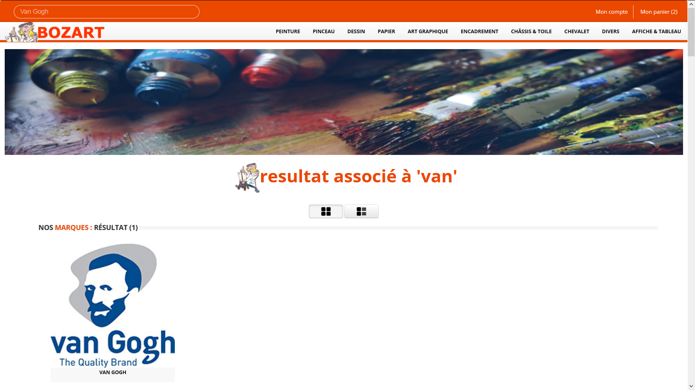

# Bozart

Voici le site web que j'ai réalisé durant mon stage de Dut qui a duré 10 semaines.
J'ai réalisé le site entièrement seul, sans cahier des charges prédéfini. j'ai réalisé la base de données (j'ai dû la remplir à la main car
la personne qui gérait l'administration de l'ancien cite n'a jamais voulue me donner accès au code et à la base de données), le front-end, le back-end et le côté admin.
c'est un site en E-cormece de vente d'articles liés à l'art, il est pratiquement fini il manque juste le côté payement et des petits bugs on du se créer depuis le temps.
# quelque capture
Voici une capture de la page d'accueil qui propose un carrousel qui présente le magasin, puis les promotions, les nouveaux articles ainsi que ses principaux partenaires.

Pour l'achat des peintures le site sépare les types de peinture puis il filtre par marque et enfin il affiche la palette de couleurs et pour chaque couleur son conditionnement.

Ci-dessous, vous pouvez voir les différents affichages pour les listes des produits.

Ci-dessous, vous pouvez voir le détail d'un produit.

Ci-dessous le compte.

Puis le panier.

Le résultat de la barre de recherche.

