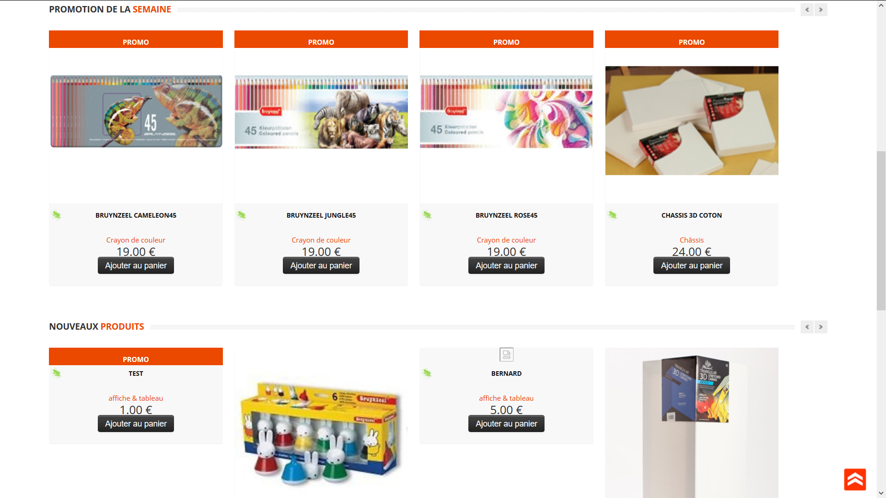
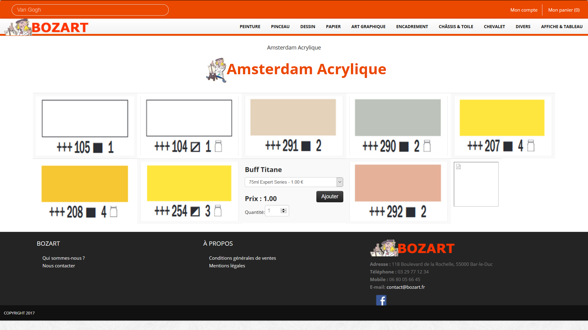

# Bozart

Voici le site web que j'ai réalisé durant mon stage de Dut qui a duré 10 semaines.
J'ai réalisé le site entièrement seul, sans cahier des charges prédéfini. j'ai réalisé la base de données, le front-end, le back-end et le coté admin.
c'est un site en E-cormece de vente d'article lié a l'art, il est pratiquement fini il manque juste le coté payement et des petits bugs on du se créer depuis le temps.
# quelque capture
Voici une capture de la page d'accueil qui propose un carrousel qui présente le magasin, puis les promotions, les nouveaux articles ainsi que ses principaux partenaires.

Ci-dessous, vous pouvez voir la page qui permet d'acheter des tubes de peinture grâce a une palette des couleurs disponible.

Ci-dessous, vous pouvez voir les différents affichages pour les listes des produits.

Ci-dessous, vous pouvez voir le détail d'un produit.

Puis le panier.

